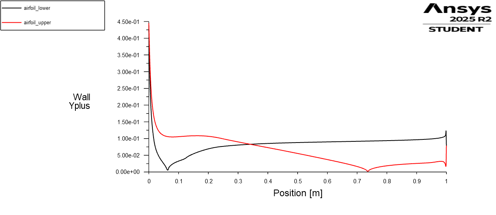

# Mesh Fidelity and $y^+$ Validation Study

## Overview
To train reliable Machine Learning surrogates (like PINNs), the underlying CFD dataset must be physically accurate. This brief study verifies the fidelity of our  aerodynamic mesh by evaluating the non-dimensional wall distance ($y^+$). 

Because we are utilizing the $k-\omega$ SST turbulence model to predict adverse pressure gradients and potential flow separation, we must resolve the viscous sublayer directly. This requires a strict $y^+$ value of $\le 1.0$ at the first grid cell adjacent to the airfoil surface.

## Validation Methodology
Instead of testing a benign condition, mesh is evaluated at the most extreme flow condition in our dataset:
* **Airfoil:** NACA 0012
* **Condition:** Angle of Attack ($\alpha$) = 18 degrees
* **Turbulence Model:** $k-\omega$ SST (Shear Stress Transport)
* **Target $y^+$:** $< 1.0$ across the entire chord

By verifying the mesh at 18 degrees where velocity gradients, boundary layer thickness, and flow turning are at their absolute maximum—we can mathematically guarantee the mesh is sufficient for all lower Angles of Attack in our parameter sweep.

## Results 
The $y^+$ distribution was plotted along both the upper and lower surfaces of the airfoil at $\alpha = 18^\circ$.

 

**Key Observations:**
* **Maximum $y^+$:** Peaked at $\approx 0.45$, highly localized at the leading-edge stagnation and primary acceleration zone.
* **Average $y^+$:** Remained well below 0.15 across the majority of the chord length.
* **Solver Stability:** The simulation converged smoothly at 735 iterations, successfully capturing the massive aerodynamic loading ($C_l = 1.5875$, $C_d = 0.0412$).

## Conclusion
The mesh completely satisfies the strict $\le 1.0$ requirement for the $k-\omega$ SST model. Because the maximum $y^+$ stayed below 0.5 under the most severe aerodynamic loading condition, the boundary layer resolution is validated for the entire dataset. The resulting $C_p$, $C_l$, and $C_d$ data used to train the Neural Network surrogates is high-fidelity and physically sound.